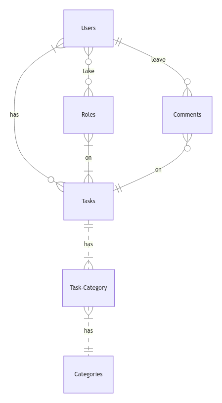

# TASK MANAGER WEBSITE DATABASE

By Ngo Minh Tan

Video overview: https://youtu.be/IFfOULopmNA

## Scope

The database simulate database of a task manager webapp, includes all entities necessary to facilitate the process of manage tasks's progress and leaving feedback on users work. The DBMS in use is MySQL .As such, included in the database's scope is:

* Users, including basic identifying information
* Tasks, including basic identifying information, the time at which the task will due, its priority (Low, Medium, High), its status(Not Started, In Progress, Completed), the created date and updated date.
* Categories submissions, including the name of category. Tasks can be associated with multiple categories.
* Roles, which includes the id and role of a user and id of task which they are assigned, also the date which they are assigned the role.
* Comments on task, including the content of the comment, the comment's date and the task on which comment was left.

Out of scope are elements like attachments, subtasks, reminders, and other non-core attributes.

## Functional Requirements

This database will support:

* CRUD operations for userss and instructors
* Tracking all versions of users submissions, including multiple submissions for the same problem
* Adding multiple comments to a users submission from instructors

Note that in this iteration, the system will not support users responding to comments.

## Representation

Entities are captured in SQLite tables with the following schema.

### Entities

The database includes the following entities:

#### Users

The `users` table includes:

* `id`, which specifies the unique ID for the users as an `INT UNSIGNED`. `UNSIGNED` is used to make sure there are no negative ids This column thus has the `PRIMARY KEY` constraint applied.
* `first_name`, which specifies the users's first name as `VARCHAR(50)` with the maximum number of characters is 50, given `VARCHAR(50)` is appropriate for name fields. It has a _CHECK_ constraint which check if the name isn't include number in them. 
* `last_name`, which specifies the users's last name. `VARCHAR(50)` is used for the same reason as `first_name`. It also has the _CHECK_ constraint like `first_name`.
* `username`, which specifies the users's username. `VARCHAR(15)` is used for the same reason as `first_name`. A `UNIQUE` constraint ensures no two users have the same GitHub username.
* `email`, which specifies the user's email. `VARCHAR(128)` is used for the same reason as `first_name`. 
* `password`, which specifies the user's password. `VARCHAR(128)` is used for the same reason as `first_name`.

####  Tasks

The `tasks` table includes:

* `id`, which specifies the unique ID for the task as an `INT UNSIGNED`. This column thus has the `PRIMARY KEY` constraint applied.
* `creator_id`, which is the ID of the users who made the submission as an `INT UNSIGNED`. This column thus has the `FOREIGN KEY` constraint applied, referencing the `id` column in the `users` table to ensure data integrity.
* `title`, which specifies the title or name of the task as `VARCHAR(255)`.
* `description`, which specifies the text's description as `TEXT`. It allows for longer text entries
* `due_date`, indicating the due date and time for the task as `DATETIME`. `DATETIME` date type includes both date and time, as the name suggested.
* `priority`, representing the priority level of the task as `ENUM`. It can take one of three values: 'Low', 'Medium', or 'High'. 
* `status`, indicating the current status of the task as `ENUM`. It can take one of three values: 'Not Started', 'In Progress', or 'Completed'. 
* `created_date`, representing the date and time when the task was created using `TIMESTAMP`. `TIMESTAMP` includes both date and time just like `DATETIME` but is more percise for logging reasons. The default value for the `created_date` attribute is the current timestamp, as denoted by `DEFAULT CURRENT_TIMESTAMP`.
* `updated_date`, representing the date and time when the task was last updated as `TIMESTAMP`. `TIMESTAMP` is used for the same reason as `created_date`. The default value is also the current timestamp, as denoted by `DEFAULT CURRENT_TIMESTAMP`. It also auto using the current timestamp each time the task is updated, hence the use of `ON UPDATE CURRENT_TIMESTAMP`

All columns in the `tasks` table are required and hence should have the `NOT NULL` constraint applied.

#### Categories

The `categories` table includes:

* `id`, which specifies the unique ID for the instructor as an `INT UNSIGNED`. This column thus has the `PRIMARY KEY` constraint applied.
* `name`, which is the name of the problem set as `VARCHAR(30)`, 30 is the sufficient length for the category's name.

All columns in the `categories` table are required, and hence should have the `NOT NULL` constraint applied. No other constraints are necessary.

#### Task_category
The `task_category` table includes:
* `id`, which specifies the unique ID for the instructor as an `INT UNSIGNED`. This column thus has the `PRIMARY KEY` constraint applied.
* `task_id`, which is the ID of the users who made the submission as an `INT UNSIGNED`. This column thus has the `FOREIGN KEY` constraint applied, referencing the `id` column in the `tasks` table to ensure data integrity.
* `category_id`, which is the ID of the users who made the submission as an `INT UNSIGNED`. This column thus has the `FOREIGN KEY` constraint applied, referencing the `id` column in the `categories` table to ensure data integrity.

#### Roles

The `roles` table includes:

* `id`, which specifies the unique ID for the submission as an `INTEGER`. This column thus has the `PRIMARY KEY` constraint applied.
* `assigned_user_id`, which is the ID of the users who made the submission as an `INTEGER`. This column thus has the `FOREIGN KEY` constraint applied, referencing the `id` column in the `users` table to ensure data integrity.
* `task_id`, which is the ID of the problem which the submission solves as an `INTEGER`. This column thus has the `FOREIGN KEY` constraint applied, referencing the `id` column in the `tasks` table to ensure data integrity.
* `assigned_date`, indicating the due date and time for the task as `DATETIME`. `DATETIME` date type includes both date and time, as the name suggested.
* `role`, indicating the role of the collaborator in the task as `ENUM`. It can take one of three values: Assignee - The person responsible for completing the task, Creator - The person created the task, Approver - The person who has the authority to approve or reject the completion of the task, Collaborator - A general role for someone actively participating in the task but without a specific assigned responsibility. 

All columns are required and hence have the `NOT NULL` constraint applied where a `PRIMARY KEY` or `FOREIGN KEY` constraint is not.

#### Comments

The `comments` table includes:

* `id`, which specifies the unique ID for the submission as an `INTEGER`. This column thus has the `PRIMARY KEY` constraint applied.
* `user_id`, which specifies the ID of the instructor who wrote the comment as an `INTEGER`. This column thus has the `FOREIGN KEY` constraint applied, referencing the `id` column in the `users` table, which ensures that each comment be referenced back to a users.
* `task_id`, which specifies the ID of the submission on which the comment was written as an `INTEGER`. This column thus has the `FOREIGN KEY` constraint applied, referencing the `id` column in the `tasks` table, which ensures each comment belongs to a particular task.
* `comment`, which contains the contents of the columns as `TEXT`, given that `TEXT` can still store long-form text.
* `comment_date`, representing the date and time when the task was created using `TIMESTAMP`. `TIMESTAMP` includes both date and time just like `DATETIME` but is more percise for logging reasons. The default value for the `comment_date` attribute is the current timestamp, as denoted by `DEFAULT CURRENT_TIMESTAMP`.

All columns are required and hence have the `NOT NULL` constraint applied where a `PRIMARY KEY` or `FOREIGN KEY` constraint is not.

### Relationships

The below entity relationship diagram describes the relationships among the entities in the database.

As detailed by the diagram:

* One users is capable of having 0 to many tasks. 0, if they have yet  just create their account, and many if they got assign to one or more tasks. A tasks can be assigned to one or more users. 
* A role can be assign to 0 to many users. 0 if no users have yet got assigned to that role, and many because a role can be taken by many users. 
A role can work on one to many tasks. At them same time, a task have at least one role associated with (the creator) it or many roles.
* A comment is associated with one and only one user, whereas a task can have 0 to many comments: 0 if a user has yet to comment on the submission, and many if many users leave comments on the task.
* A task needed to have at least one or many categories. And on the other hands, a category have at least one task associated with it or many tasks can have the same category.

## Optimizations

Per the typical queries in `queries.sql`, it is common for users of the database to access all tasks associated with any particular users. For that reason, indexes are created on the `first_name`, `last_name`, and `username` columns on `users` table to speed the identification of userss by those columns.

Similarly, it is also common practice for a user of the database to concerned with viewing all tasks associated with a user. As such, an index is created on the `title` column in the `tasks` table to speed the identification of problems by name.

Finally, users might want to see the categories associated with a task. Because of that, an index is created on the `name` column in the `categories`  table to speed the identification of problems by name.

